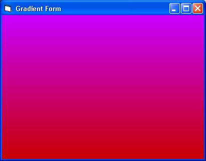

<div align="center">

## Form gradient using three only lines of code


</div>

### Description

This is how to use gradient colors in a form. You do not need to do anything or write lines of code to add gradient to your forms. Just put the these three lines in Form_Load Sub

Update Note: Thanks for comments, Form_Resize is a better sub if your form is not fixed size
 
### More Info
 


<span>             |<span>
---                |---
**Submitted On**   |
**By**             |[Behrooz Sangani](https://github.com/Planet-Source-Code/PSCIndex/blob/master/ByAuthor/behrooz-sangani.md)
**Level**          |Beginner
**User Rating**    |4.8 (19 globes from 4 users)
**Compatibility**  |VB 6\.0
**Category**       |[Custom Controls/ Forms/  Menus](https://github.com/Planet-Source-Code/PSCIndex/blob/master/ByCategory/custom-controls-forms-menus__1-4.md)
**World**          |[Visual Basic](https://github.com/Planet-Source-Code/PSCIndex/blob/master/ByWorld/visual-basic.md)
**Archive File**   |[](https://github.com/Planet-Source-Code/behrooz-sangani-form-gradient-using-three-only-lines-of-code__1-32748/archive/master.zip)

### API Declarations

```
'none
```


### Source Code

```
'=============================================
' Form Gradient
' Add gradient with three lines of code
'=============================================
' Created By: Behrooz Sangani
' Published Date: 27/11/2001
' Email: bs20014@yahoo.com
' Use for free. No obligation!
'=============================================
Private Sub Form_Resize()
'You do not need to do anything or write lines of code _
to add gradient to your forms. Just put the following _
lines in Form_Resize Sub
'This line is important. You must set the form autoredraw _
to true else nothing would happen. Another problem even _
if you manage to add gradient is you would not be able _
to use labels in your form. Try this and see the results _
labels can't become transparent.
AutoRedraw = True
'This form gradient is a little slow! To help gradient draw _
'faster you need to set your form ScaleMode to pixels.
'This would do great, at least on my PC.
ScaleMode = vbPixels
'Change RGB Numbers in For-Next to have your desired color.
' R=200, G=0, B=255
'Horizental Gradient
For Y = 0 To ScaleHeight
   Line (-1, Y - 1)-(ScaleWidth, Y + 1), RGB(200, 0, 255 - (Y * 255) \ ScaleHeight), B
Next Y
' If you want vertical gradient just reverse the variables. _
Like this:
' For X = 0 To ScaleWidth
'   Line (X - 1, -1)-(X + 1, ScaleWidth), RGB(200, 0, 255 - (X * 255) \ ScaleWidth), B
' Next X
End Sub
```

